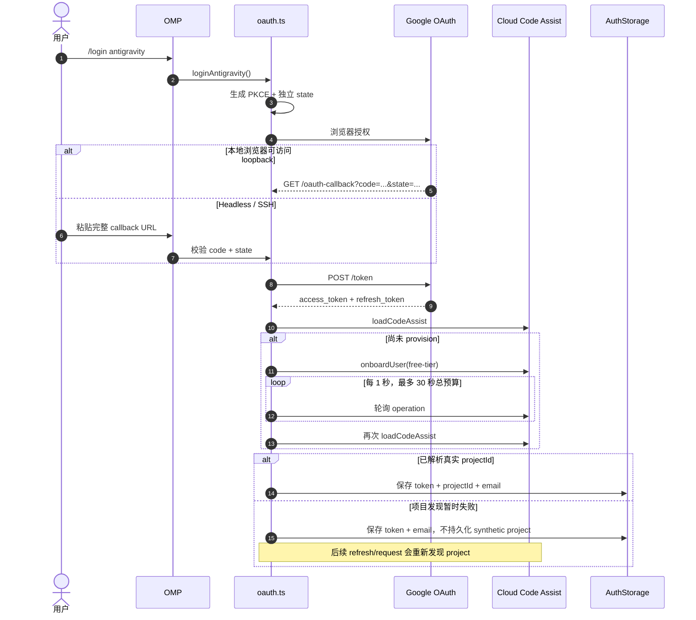
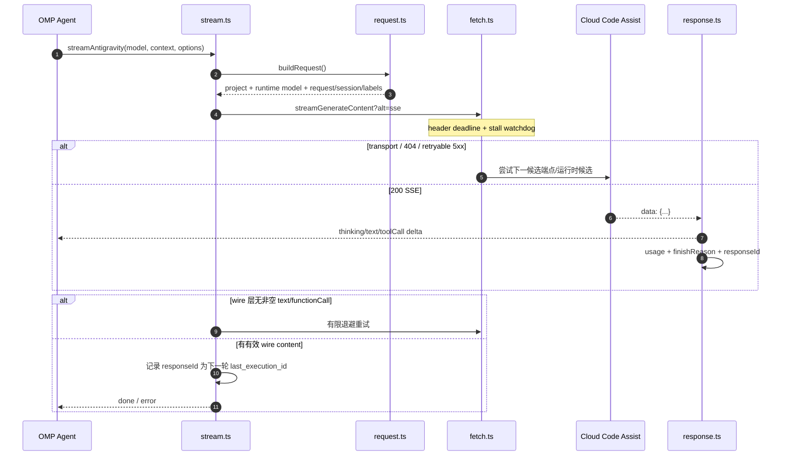
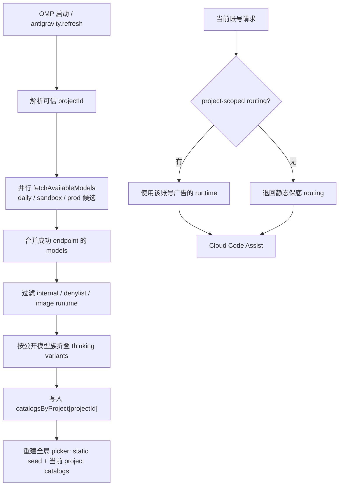
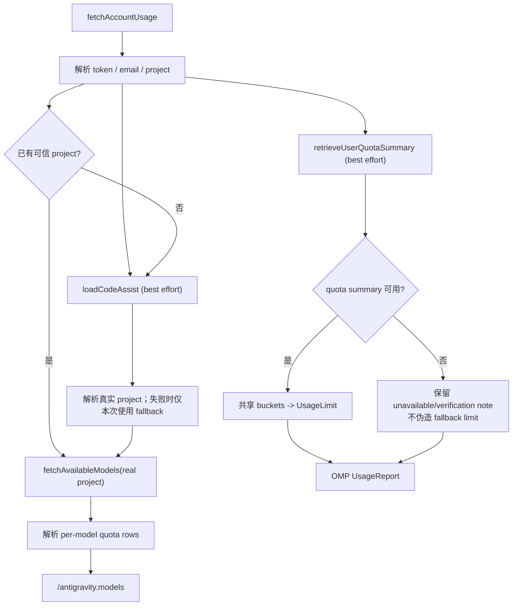
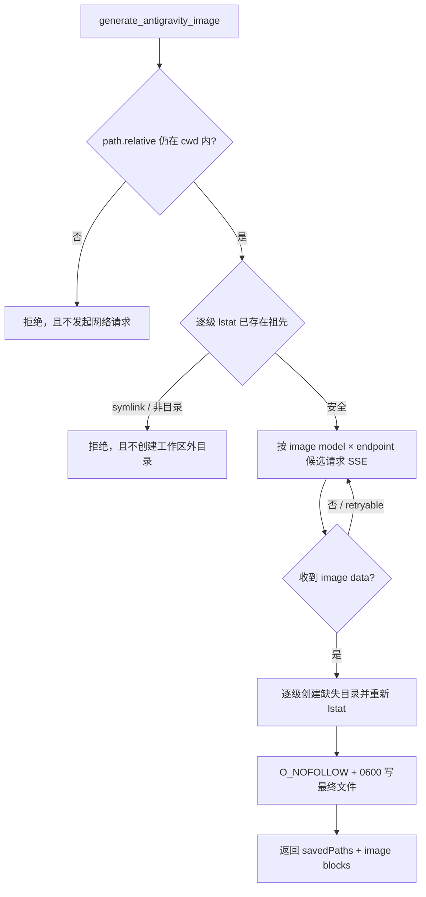

# omp-antigravity

[](https://www.npmjs.com/package/omp-antigravity)
[](https://www.npmjs.com/package/omp-antigravity)
[](LICENSE)

**omp-antigravity** 是面向 [Oh My Pi](https://omp.sh) (OMP) 的扩展插件，按 OMP Provider / Extension API 直连 Google Antigravity / Cloud Code Assist。它支持动态发现 Gemini、Claude 与 GPT-OSS 运行时模型，并提供 OAuth、多账号、流式协议转换、配额查看和图片生成能力。

插件不依赖外部 Antigravity CLI 或中间网关；认证、项目发现、模型目录、HTTP/SSE 传输、用量归一化与图片落盘均在扩展内部完成。

> **非官方集成声明**：本项目非 Google 官方产品，与 Google 无关联或背书。请仅在已获授权的账号和服务下使用。在授予 OAuth 权限前请审阅源码。

---

## 目录

- [核心特性](#核心特性)
- [实现边界与兼容说明](#实现边界与兼容说明)
- [系统架构与详细设计](#系统架构与详细设计)
  - [1. 整体架构与模块交互](#1-整体架构与模块交互)
  - [2. 认证与账号开通子系统 (Auth)](#2-认证与账号开通子系统-auth)
  - [3. 流式传输与协议转换子系统 (Stream)](#3-流式传输与协议转换子系统-stream)
  - [4. 模型路由与动态目录发现 (Models & Client)](#4-模型路由与动态目录发现-models--client)
  - [5. 配额监控与用量归一化 (Usage)](#5-配额监控与用量归一化-usage)
  - [6. 生图工具与符号链接防御 (Image Gen)](#6-生图工具与符号链接防御-image-gen)
- [环境依赖](#环境依赖)
- [安装与管理](#安装与管理)
- [快速开始](#快速开始)
- [命令与工具参考](#命令与工具参考)
  - [斜杠命令 (Slash Commands)](#斜杠命令-slash-commands)
  - [LLM 可调用工具 (generate_antigravity_image)](#llm-可调用工具-generate_antigravity_image)
- [静态保底模型与动态目录](#静态保底模型与动态目录)
- [配置项与环境变量](#配置项与环境变量)
- [常见问题与故障排查](#常见问题与故障排查)
- [本地开发与测试](#本地开发与测试)
- [开源协议与鸣谢](#开源协议与鸣谢)

---

## 核心特性

- **原生直连**：直接调用 Cloud Code Assist 的 HTTP JSON / SSE 端点，支持候选端点故障切换、连接预热、首包超时与流中停顿看门狗。
- **OAuth 与多账号**：实现 OAuth 2.0 PKCE、本地回调与远程粘贴回调、首次账号 Onboarding、Token 刷新、会话账号锁定以及账号级诊断隔离。
- **动态模型目录**：运行时聚合账号可见的 Gemini、Claude 与 GPT-OSS 模型，将底层 thinking runtime 折叠为 OMP 公开模型，并按账号项目隔离路由。
- **流式协议转换**：完成消息、多模态内容、工具调用、Thinking、`responseId`/`last_execution_id` 与 OMP 事件流之间的双向映射；wire 层未返回非空文本 part 或 function call 时会执行有限退避重试。
- **原生 UsageProvider**：读取共享配额窗口并映射到 OMP `UsageReport`；额度值缺失时保留为 `unknown`，不会伪造为 0%。模型级 quota 同时可通过 `/antigravity.models` 查看。
- **防御型生图**：`generate_antigravity_image` 使用 `approval: "write"`，按内置图片模型候选链重试，并在远端生成前进行路径/祖先符号链接预检，最终文件使用 `O_NOFOLLOW` 私有权限写入。

---

## 实现边界与兼容说明

当前实现有几项刻意保留的边界，使用和二次开发时应以这里的语义为准：

- **文本模型是动态发现，图片模型不是**：聊天模型目录来自 `/v1internal:fetchAvailableModels`；图片生成当前使用内置候选链（默认 `gemini-3-pro-image`）或用户显式 `--model`，不会从动态目录自动挑选 image model。
- **模型可用性按账号隔离**：模型选择器展示的是静态保底模型与当前进程已发现账号目录的并集；真正请求时只使用当前账号的 project-scoped routing。某模型出现在选择器中，不代表当前账号一定拥有该模型权限。
- **汇总额度与模型级额度是两种视图**：OMP 原生 `UsageReport` 只发布 `/v1internal:retrieveUserQuotaSummary` 返回的共享配额池；免费层等场景若该接口不可用，会显示说明而不是伪造 fallback limit。模型级 quota 仍可在 `/antigravity.models` 中查看。
- **Tool Schema 只展开本地 `$ref`**：支持 `#` / `#/...` RFC 6901 JSON Pointer。本插件不会主动抓取远程/外部 schema；无法解析或存在环的工具 schema 会被隔离，并通过 `/antigravity.doctor` 的 `toolSchemaWarnings` 暴露。
- **旧环境变量前缀仍兼容**：所有 `ANTIGRAVITY_*` 配置同时接受历史 `NOAGY_*` 前缀；新配置应优先使用 `ANTIGRAVITY_*`。

---

## 系统架构与详细设计

### 1. 整体架构与模块交互

插件采用分层解耦架构，通过模块门面接入 OMP 扩展生命周期，直连 Google Cloud Code Assist 远端底层服务：

```mermaid
flowchart TD
    subgraph Host ["OMP 宿主运行时"]
        UI["TUI 界面 / 用户输入与渲染"]
        Agent["Agent 执行引擎 (Tool Loop)"]
        AuthDB["AuthStorage (~/.omp/agent/agent.db)"]
        Registry["ModelRegistry & UsageRegistry"]
    end

    subgraph Plugin ["omp-antigravity 插件架构"]
        Entry["src/index.ts (插件主入口 & 扩展生命周期)"]

        subgraph AuthSys ["src/auth/ (认证与开通)"]
            OAuth["oauth.ts (PKCE 认证 & 令牌刷新)"]
            Callback["本地 51121 监听 / 终端 URL 提取"]
        end

        subgraph StreamSys ["src/stream/ (流式调度与协议转换)"]
            StreamCoord["stream.ts (调度协调器)"]
            ReqBuilder["request.ts (信封组装 & SessionId)"]
            MsgConvert["messages.ts (多模态协议转换)"]
            SchemaMod["schema.ts (Tool Schema 反引用展开)"]
            FetchGuard["fetch.ts (首包 180s & 停顿 120s 看门狗)"]
            RespParser["response.ts (SSE 状态机 & Delta 分发)"]
            LeakGuard["leak-detector.ts (规划 JSON 泄露拦截)"]
            ErrHandler["errors.ts (人机挑战 & 错误分类)"]
            CostCalc["cost.ts (Token 成本归一化)"]
        end

        subgraph ModelsSys ["src/models/ & src/client/ (模型管理)"]
            Discovery["discovery.ts (动态模型探测)"]
            Grouping["grouping.ts (黑名单过滤 & 目录折叠)"]
            Routing["models.ts (Thinking 档位映射)"]
            Client["client.ts (多候选端点调度 & Onboarding)"]
        end

        subgraph UsageSys ["src/usage/ (配额监控)"]
            UsageProv["usage.ts (UsageProvider 归一化聚合)"]
        end

        subgraph ImageSys ["src/image/ (生图安全)"]
            ImageGen["image.ts (候选模型重试 & 路径/符号链接防御)"]
        end
    end

    subgraph Remote ["Google Cloud Code Assist 远端服务"]
        GoogleAuth["accounts.google.com / oauth2.googleapis.com"]
        DailyEP["daily-cloudcode-pa.googleapis.com (主端点)"]
        ProdEP["cloudcode-pa.googleapis.com (备用端点)"]
    end

    UI -->|/login antigravity| OAuth
    OAuth --> Callback
    OAuth -->|PKCE 换取令牌| GoogleAuth
    OAuth -->|自动开通 /v1internal:onboardUser| DailyEP
    OAuth -->|持久化安全凭据| AuthDB

    Agent -->|streamSimple 请求| StreamCoord
    StreamCoord --> ReqBuilder
    ReqBuilder --> MsgConvert & SchemaMod
    StreamCoord --> FetchGuard -->|SSE POST 流式请求| DailyEP
    DailyEP -.->|404/5xx 故障切换| ProdEP
    FetchGuard --> RespParser
    RespParser --> LeakGuard & CostCalc & ErrHandler
    RespParser -->|增量 Delta / ToolCall| Agent

    Registry -->|fetchDynamicModels| Discovery
    Discovery --> Grouping --> Routing
    Discovery -->|/v1internal:fetchAvailableModels| DailyEP

    Registry -->|fetchUsage| UsageProv
    UsageProv -->|/v1internal:retrieveUserQuotaSummary| DailyEP

    Agent -->|generate_antigravity_image| ImageGen
    ImageGen -->|SSE 生图流请求| DailyEP
    ImageGen -->|路径预检 + no-follow 落盘| Workspace[".omp/generated-images/"]
```



---

### 2. 认证与账号开通子系统 (Auth)

位于 `src/auth/` 与 `src/client/`，负责 Google OAuth 2.0 生命周期、首次账号开通和项目发现：

- **PKCE 与 state**：使用独立随机值生成 `code_verifier` / `code_challenge` 与 OAuth `state`，避免把 PKCE verifier 复用为 state。
- **本地回调 + Headless 粘贴**：监听 `127.0.0.1:51121/oauth-callback`；远程/SSH 环境可把浏览器地址栏中的完整回调 URL 粘贴回 OMP。无效、缺参或 state 不匹配的请求返回错误，但不会误终止仍在进行的合法登录。
- **首次 Onboarding**：`loadCodeAssist` 若发现账号尚未 provision，会检查免费层资格并调用 `/v1internal:onboardUser`。长操作以 1 秒间隔轮询，整个 onboarding 共享 30 秒预算。
- **项目恢复语义**：只有 Google 实际返回的 projectId 才被视为可信。若登录阶段项目发现暂时失败，不会把 synthetic fallback 持久化为权威项目；后续 Token refresh、stream、model discovery 与 image 请求会再次尝试 `loadCodeAssist`。
- **Token 刷新**：已有可信 projectId 时刷新 access token 不重复做项目发现；缺失或历史 placeholder project 则自动重新发现。
- **多账号隔离**：账号 identity 由 OMP `AuthStorage` 管理；请求路由、动态模型枚举、诊断和会话轨迹均按账号/project scope 隔离或设置容量上限。



---

### 3. 流式传输与协议转换子系统 (Stream)

位于 `src/stream/`，负责 OMP 消息与 Cloud Code Assist wire protocol 之间的转换：

1. **`request.ts`（请求与轨迹）**：使用 OMP `sessionId`（缺失时生成稳定后备），生成顶层 `requestId=agent/<conversation>/<timestamp>/<trajectory>/<step>`；同时在 labels 中写入 `request_id=<trajectoryId>-<requestIndex>`、`trajectory_id` 与可选 `last_execution_id`。
2. **`messages.ts`（消息转换）**：转换文本、图片、assistant tool call 与 tool result，保持 `thoughtSignature` 和 toolCallId 配对；模型侧 compact history 需要时补一个 continuation user turn。
3. **`schema.ts`（工具 Schema）**：展开本地 RFC 6901 `$ref`、限制递归深度/节点数、剥离后端不接受的 metadata；Claude/GPT custom-tool bridge 进一步压缩到后端支持的 allowlist。无法安全展开的单个工具会被省略并记录诊断，而不是拖垮整次请求。
4. **`fetch.ts`（双看门狗）**：响应头默认 180 秒超时，SSE 中途无数据默认 120 秒超时；每收到一个 chunk 会重置 stall timer，正常长响应不会被固定总时长切断。
5. **`response.ts`（SSE 状态机）**：增量输出 `thinkingDelta`、`textDelta` 与 `toolCall`，解析 usage/finishReason/responseId，并处理 EOF 前没有尾换行的最后一条 `data:`。
6. **`leak-detector.ts`（规划 JSON 过滤）**：仅缓冲疑似 planning JSON 前缀，识别后抑制泄露的内部规划对象，同时保留其后的普通文本。
7. **错误与重试**：网络失败、404 与指定 5xx 可切换候选端点；401/403 与真实 quota wall 不跨端点重试。wire 层完全没有非空文本 part 或 function call 时最多进行两次退避重试。
8. **成本归一化**：优先调用 OMP extension loader 暴露的 `calculateCost` 兼容 helper；在普通 Bun/Node 测试环境不存在该 helper 时使用等价的 flat-rate 计算。



---

### 4. 模型路由与动态目录发现 (Models & Client)

位于 `src/models/` 与 `src/client/`：

- **多候选端点目录聚合**：`fetchAvailableModelsCatalog` 会并行查询当前候选端点，将成功响应中的 `models` 合并；单端点的 transient failure 不会直接丢掉整个动态目录。
- **动态过滤与折叠**：过滤 internal/denylisted/image runtime，并把 `-minimal` / `-low` / `-medium` / `-high` / `-extra-high` 等底层变体折叠为一个公开模型。
- **能力取保守交集**：同一模型族多个 runtime 的 context/output 限制取保守值，图片能力也采用保守合并；Thinking 控件只发布实际广告或可推导的档位。
- **Availability-first Thinking fallback**：优先向较低成本档位退化；如果一个模型族后端只部署较高档位，则允许向上 fallback，避免因不存在的低档 runtime 直接 404。
- **账号级 routing**：每个 project 保存自己的动态 routing 与 `model_enum`。请求时先查当前账号 catalog，再退回静态保底 routing，不会借用其他账号的动态 runtime id。
- **全局选择器收敛**：OMP 的模型 picker 是 host-global，因此插件会把静态 seed 与当前缓存 project catalogs 重建为并集；同一 project 后续刷新会替换旧 catalog，使已经从该 project 消失的 dynamic-only model 收敛退出。缓存有容量上限，不会无限增长。



---

### 5. 配额监控与用量归一化 (Usage)

位于 `src/usage/`：

- **OMP 原生 UsageProvider**：把共享 quota bucket 转成标准 `UsageReport`，带上 provider、project、account email、tier、window 与 reset time。
- **项目解析后再取模型目录**：如果 credential 没有可信 projectId，会先等待 `loadCodeAssist`，再以真实 project 请求 `fetchAvailableModels`；避免把 synthetic placeholder 带入模型目录请求。
- **汇总 quota 是 best-effort**：`/v1internal:retrieveUserQuotaSummary` 对某些免费层/未授权账号会返回 403。此时插件保留错误说明，不把它误判为 credential 失效，也不会制造假的 0% 或假的 fallback UsageLimit。
- **未知值保持未知**：bucket 存在但 `remainingFraction` 缺失时，UI 显示 `?`，normalized status 为 `unknown`。
- **模型级 quota 独立保留**：同一次 usage 采集还会解析 `fetchAvailableModels` 中的 per-model quota，供 `/antigravity.models` 展示；它不会被错误地当成共享 quota pool 填入 OMP 原生 UsageReport。
- **多账号命令**：`/antigravity.accounts` 最多 3 个 worker 并发检查账号，并共享 20 秒总 deadline，避免大量账号把 TUI 长时间卡住。



---

### 6. 生图工具与符号链接防御 (Image Gen)

位于 `src/image/`：

- **固定候选链 + 显式覆盖**：默认从 `gemini-3-pro-image` 开始，随后尝试内置 fallback image models；用户可通过 `--model` / tool 参数指定允许格式的 image model。当前不会从聊天模型动态目录自动选择 image model。
- **独立 attempt deadline**：每个 endpoint/model 尝试拥有自己的 120 秒 deadline；401/403/429 等账号级错误立即停止 fan-out，404/指定 5xx 与 transport failure 才会继续候选。
- **SSE 尾帧完整性**：图片流与文本流一样，会处理 EOF 前没有换行符的最后一条 `data:`。
- **生成前路径预检**：先用 `path.relative` 拒绝工作区外路径，再逐级 `lstat` 已存在祖先；遇到 symlink 或非目录祖先会在任何远端生成请求前失败。
- **逐级目录创建**：缺失目录逐段 `mkdir`，每层创建/竞争后重新 `lstat`，不使用会直接穿过祖先 symlink 的 recursive mkdir。
- **最终文件 no-follow**：目标文件通过 `O_NOFOLLOW` 打开并强制 `0600`，防止最终路径本身是 symlink 时覆盖其指向文件。



> 安全边界：这些检查针对路径逃逸、预先存在的祖先 symlink 与最终路径 symlink。和其他基于路径名的 Node 文件系统代码一样，如果同一主机上的不受信任进程拥有并发修改工作区目录的权限，它不等价于基于 directory-fd / `openat` 的完全无竞态沙箱。

---

## 环境依赖

- **OMP (Oh My Pi)**：`>= 18.0.0`（经 OMP 18.2.1 完整验证）。
- **Google 账号**：具备访问 Cloud Code Assist / Antigravity 的权限。
- **Node/Bun 运行时**：OMP 内置运行环境（支持 TS 直接加载）。

---

## 安装与管理

### 1. 从 npm 安装（推荐）

```bash
omp plugin install omp-antigravity
```

### 2. 从 GitHub 仓库安装

```bash
omp plugin install github:oscs1024-pixel/omp-antigravity
```

### 3. 本地开发软链

克隆仓库后，在插件根目录下运行：

```bash
omp plugin link .
```

### 4. 插件状态与更新

```bash
# 查看已安装插件
omp plugin list

# 执行健康检查
omp plugin doctor

# 升级插件
omp plugin upgrade omp-antigravity

# 卸载插件
omp plugin uninstall omp-antigravity
```

---

## 快速开始

1. **登录授权**：
   在 OMP 会话中输入登录命令：

   ```text
   /login antigravity
   ```

   在弹出的浏览器窗口中完成 Google 账号登录。

2. **切换模型**：

   ```text
   /model antigravity/gemini-3.8-flash
   ```

3. **开始对话**：
   正常发送代码任务即可。如遇网络波动或异常，运行诊断命令排查：
   ```text
   /antigravity.doctor
   ```

---

## 命令与工具参考

### 斜杠命令 (Slash Commands)

| 命令                                 | 描述                                                                                                                                               |
| ------------------------------------ | -------------------------------------------------------------------------------------------------------------------------------------------------- |
| `/login antigravity`                 | 启动 Google OAuth 授权登录流程。                                                                                                                   |
| `/antigravity.accounts`              | 列出所有存储的 Antigravity 账号、当前会话锁定状态（锁定账号前置绿色圆点 `●` 与 `[ACTIVE]` 标识；未锁定时提示 host auto-selects）及各账号实时配额。 |
| `/antigravity.accounts <1 \| email>` | 为当前会话锁定指定账号（支持序号如 `/antigravity.accounts 2`、邮箱关键词如 `oscs1024`）。                                                          |
| `/antigravity.usage`                 | 打印当前账号各共享配额池（Gemini / Claude + GPT）的剩余百分比与重置倒计时。                                                                        |
| `/antigravity.models`                | 查看当前账号生效的动态运行时模型及各池状态。                                                                                                       |
| `/antigravity.models all`            | 包含默认隐藏的内部 Chat / Tab 补全底层模型。                                                                                                       |
| `/antigravity.refresh`               | 强制从服务端拉取最新的动态模型列表并更新本地映射。                                                                                                 |
| `/antigravity.doctor`                | 输出已脱敏的运行时健康诊断信息（当前端点、状态码、生效模型 ID、延迟等）。                                                                          |
| `/antigravity.image <prompt>`        | 手动生成图片并保存至 `.omp/generated-images/`。支持参数 `--ratio <ratio>`、`--model <model>`、`--path <filepath>`。                                |

### LLM 可调用工具 (`generate_antigravity_image`)

模型在遇到绘图需求时可自主发起此工具调用。

- **工具名称**：`generate_antigravity_image`
- **审批权限**：`write`（写文件权限）
- **参数规格**：
  - `prompt` (string, 必需)：生成画面的详尽文本描述。
  - `aspectRatio` (string, 可选)：画幅宽高比，可选值：`1:1`、`2:3`、`3:2`、`3:4`、`4:3`、`4:5`、`5:4`、`9:16`、`16:9`、`21:9`（默认 `1:1`）。
  - `model` (string, 可选)：指定生图模型；未指定时从内置候选链的 `gemini-3-pro-image` 开始尝试。
  - `path` (string, 可选)：保存相对路径（默认保存于 `.omp/generated-images/image-<timestamp>.png`）。
- **返回值**：包含本地持久化后的路径信息与用于在 TUI 中渲染预览的 base64 图像块。

---

## 静态保底模型与动态目录

下面是插件内置的**静态保底目录与典型路由**，用于离线/冷启动以及动态目录缺失时维持基本可用性。实际可选模型还会叠加当前账号从后端动态发现的模型族，因此这张表不是 Google 当前在线目录的穷举：

| 公开模型 ID         | 输入模态   | 支持的思考档位    | 最大输出 Tokens | 底层路由映射说明                                                                                       |
| ------------------- | ---------- | ----------------- | --------------- | ------------------------------------------------------------------------------------------------------ |
| `gemini-3.8-flash`  | 文本, 图像 | Low, Medium, High | 65,536          | low → `gemini-3.8-flash-low`<br>medium → `gemini-3.8-flash-medium`<br>high → `gemini-3.8-flash-high`   |
| `gemini-3.7-flash`  | 文本, 图像 | Low, Medium, High | 65,536          | low → `gemini-3.7-flash-low`<br>medium → `gemini-3.7-flash-medium`<br>high → `gemini-3.7-flash-high`   |
| `gemini-3.6-flash`  | 文本, 图像 | Low, Medium, High | 65,536          | 映射至 `gemini-3.6-flash` 对应 thinking runtime                                                        |
| `gemini-3.5-flash`  | 文本, 图像 | Low, Medium, High | 65,536          | low → `gemini-3.5-flash-extra-low`<br>medium → `gemini-3.5-flash-low`<br>high → `gemini-3-flash-agent` |
| `gemini-3.1-pro`    | 文本, 图像 | Low, High         | 65,535          | low → `gemini-3.1-pro-low`<br>high → `gemini-pro-agent`                                                |
| `claude-sonnet-4-6` | 文本, 图像 | High              | 64,000          | 映射至 Antigravity 托管的 `claude-sonnet-4-6`                                                          |
| `claude-opus-4-6`   | 文本, 图像 | High              | 64,000          | 映射至 `claude-opus-4-6-thinking`                                                                      |
| `gpt-oss-120b`      | 文本       | Medium            | 32,768          | 映射至 `gpt-oss-120b-medium`                                                                           |

> **提示**：动态模型是否可调用取决于当前账号/project 的实际授权；全局 picker 中可见不等于当前账号一定可用。可通过 OMP 配置文件（`~/.omp/agent/config.yml`）中的 `enabledModels` 进一步限制展示与调用的模型子集。

---

## 配置项与环境变量

所有环境变量均支持 `ANTIGRAVITY_` 前缀（兼容量早期版本的 `NOAGY_` 前缀）：

| 环境变量                                | 默认值        | 作用说明                                                                                                                |
| --------------------------------------- | ------------- | ----------------------------------------------------------------------------------------------------------------------- |
| `ANTIGRAVITY_BASE_URL`                  | -             | 覆盖默认 API 基址（必须为合法且受信任的 Google HTTPS 域名）。                                                           |
| `ANTIGRAVITY_PROJECT_ID`                | -             | 显式指定 Cloud Code Assist 项目 ID，跳过自动项目发现 round-trip。                                                       |
| `ANTIGRAVITY_CALLBACK_HOST`             | `127.0.0.1`   | OAuth 本地监听绑定地址（仅限 `127.0.0.1` 或 `localhost`）。                                                             |
| `ANTIGRAVITY_RUNTIME_MODEL`             | -             | 强制锁定所有请求至特定的底层 runtime model ID。                                                                         |
| `ANTIGRAVITY_USER_AGENT`                | 内置 CLI 指纹 | 覆盖请求 User-Agent；默认值与 Antigravity CLI 保持一致。                                                                |
| `ANTIGRAVITY_CLIENT_ID`                 | 官方默认值    | 自定义 Google OAuth 客户端 ID。                                                                                         |
| `ANTIGRAVITY_CLIENT_SECRET`             | 官方默认值    | 自定义 Google OAuth 客户端密钥。                                                                                        |
| `ANTIGRAVITY_STREAM_HEADER_TIMEOUT_MS`  | `180000` (3m) | 响应首包响应头超时阈值（毫秒）；设为 `0` 禁用。                                                                         |
| `ANTIGRAVITY_STREAM_STALL_TIMEOUT_MS`   | `120000` (2m) | SSE 传输中途卡顿超时阈值（毫秒）；设为 `0` 禁用。                                                                       |
| `ANTIGRAVITY_NO_PREWARM`                | `0`           | 设为 `1` 可跳过插件加载时针对主端点的 TLS 提前连接预热。                                                                |
| `ANTIGRAVITY_DEBUG_DUMP`                | `0`           | 设为 `1` 时，请求失败将完整 JSON 请求体写入 `/tmp/antigravity-last-request.json`。                                      |
| `ANTIGRAVITY_DISABLE_LAST_EXECUTION_ID` | `0`           | 逃生开关：设为 `1` 时禁用向请求 labels 中注入 `last_execution_id`，用于在 Google 服务端多轮轨迹会话出现异常时紧急绕过。 |

> OMP 的 `providers.antigravityEndpoint` 配置不会传递给本插件；如需覆盖服务端点，请使用 `ANTIGRAVITY_BASE_URL`。该值仅接受受信任的 Google HTTPS 域名。

---

## 常见问题与故障排查

### 1. 远程/无头机（Headless/SSH）无法打开 `localhost:51121` 登录

- **终端粘贴法（最简便，无需配置）**：
  运行 `/login antigravity`，在任意机器的浏览器中打开终端显示的 Google 授权链接并完成登录。浏览器最后会重定向至类似 `http://localhost:51121/oauth-callback?code=...` 的失败页面。此时直接复制浏览器地址栏的**完整 URL**，粘贴回 OMP 终端的提示符中按回车即可完成凭据交换。
- **SSH 端口转发法**：
  在操作机建立端口转发隧道：`ssh -N -L 51121:127.0.0.1:51121 user@remote-server`，保持连接，然后在服务器上直接运行 `/login antigravity`，浏览器即可自动完成回调。

### 2. 报错 401 / 403 或凭据过期

- 运行 `/login antigravity` 重新登录。
- 检查 `/antigravity.doctor` 查看最后一次请求对应的 `lastEndpoint` 与 `lastStatus`。

### 3. 报错 429 (Quota reached / Resource exhausted)

- 运行 `/antigravity.usage` 查看当前账号各配额池消耗情况。
- 注意：Antigravity 平台中多个同系列模型共享配额池，单纯切换同厂商模型可能仍受同一配额限制。

### 4. 出现两个 Antigravity 登录项

- 一个是 OMP 内置的 `google-antigravity`，另一个是本插件注册的 `antigravity`。二者命名空间相互独立，功能互不干扰，建议选用本插件以获取完整的用量面板与生图支持。

### 5. 多轮会话轨迹串联与 `last_execution_id` 逃生开关

- **运行机制**：Antigravity 服务端在流式响应末尾帧返回 `responseId`。插件会在多轮会话中提取上一轮生成的 ID，作为当前请求 labels 中的 `last_execution_id` 提交给 Google 端点，维持与官方 IDE 客户端完全一致的会话轨迹追踪（Session Trajectory）。
- **实测验证**：本插件已通过真实多轮上下文实时流式验证，服务端能准确接收并基于前一轮 `responseId` 返回后续轮次。
- **逃生开关**：如果 Google 后端轨迹链路出现故障或报错特定轨迹错误，可设置环境变量 `ANTIGRAVITY_DISABLE_LAST_EXECUTION_ID=1`（或 `NOAGY_DISABLE_LAST_EXECUTION_ID=1`）临时剥离该标签，此时每轮请求仅依赖常规 messages 上下文运行。

---

## 本地开发与测试

本仓库采用 TypeScript + Bun 开发，针对 OMP 18.x 插件运行规范严格对齐：

```bash
# 安装锁定依赖
bun install --frozen-lockfile

# 分项检查
bun run typecheck
bun run lint
bun run test
bun run format:check

# 一键执行全部离线门禁
bun run check
```

`bun run check` 是离线 CI 门禁，覆盖 TypeScript 严格类型检查、ESLint、`test/` 下单元/回归测试以及 Prettier 格式校验。所有门禁文件都在仓库内；新增行为回归应进入 `test/`，保证干净 checkout 后即可复现。

---

## 开源协议与鸣谢

- 本项目基于 **[MIT License](LICENSE)** 协议开源。
- 本项目系基于 Rahul Arya 开发的 [`pi-antigravity`](https://github.com/Rahularya01/pi-antigravity) 演进，并针对 Oh My Pi (OMP) 扩展架构与最新规范进行了深度重构与功能扩展。
