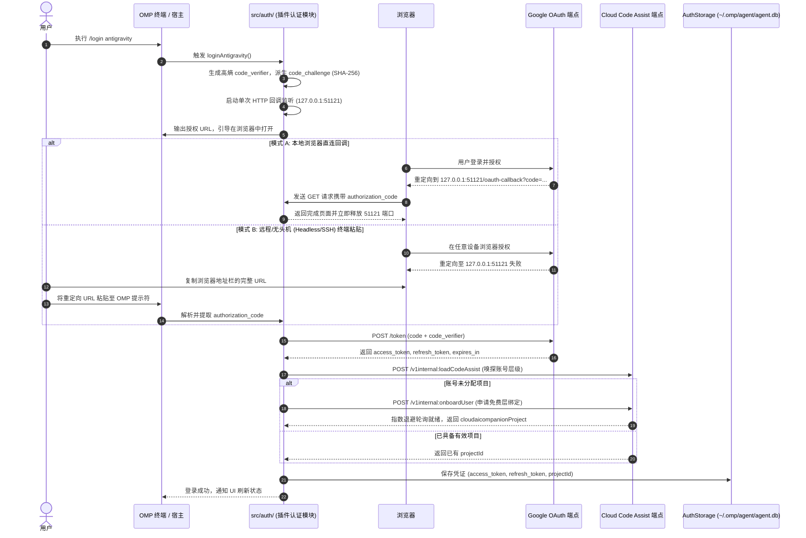
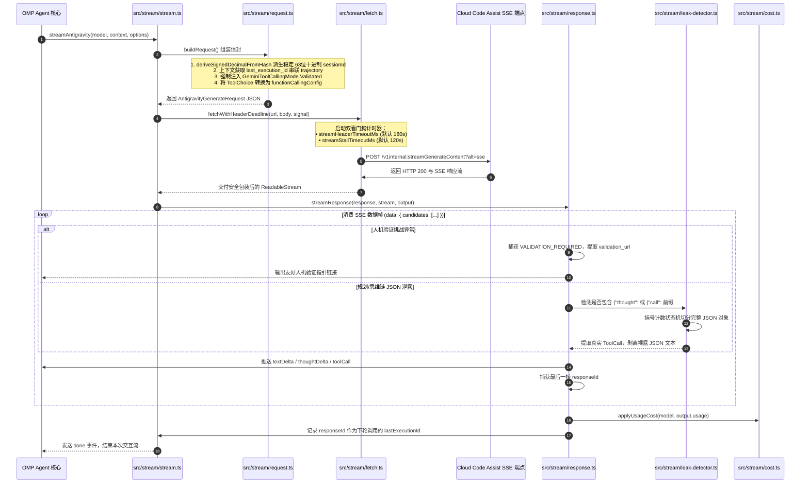
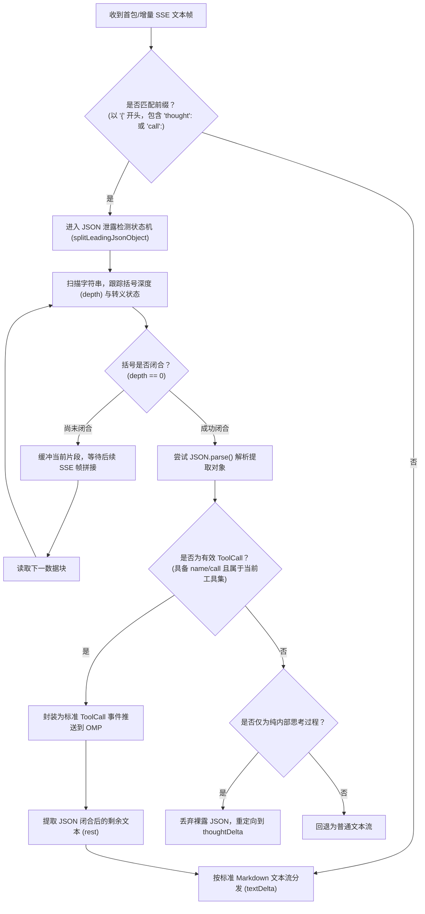
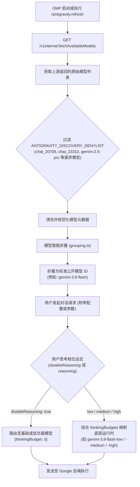
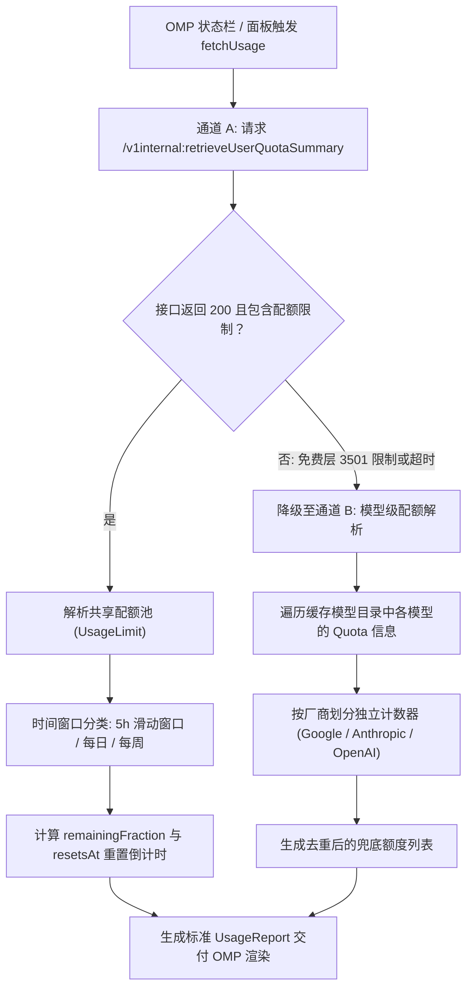
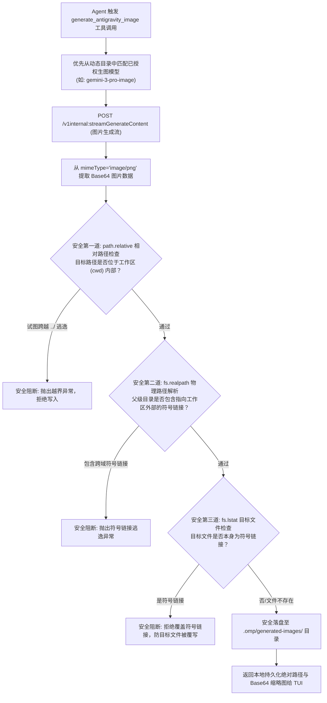

# omp-antigravity

[](https://www.npmjs.com/package/omp-antigravity)
[](https://www.npmjs.com/package/omp-antigravity)
[](LICENSE)

**omp-antigravity** 是面向 [Oh My Pi](https://omp.sh) (OMP) 的官方规范扩展插件，支持 OMP 直连 Google Antigravity / Cloud Code Assist 模型矩阵 —— 包括 Gemini 全系列、通过 Anthropic Vertex 托管的 Claude 以及通过 OpenAI Vertex 托管的 GPT-OSS。

插件在底层实现了原生 OAuth 2.0 PKCE 认证流程、账号自动开通 (Onboarding)、模型动态发现与多级 Thinking 路由折叠、双向流式协议映射与断流防护、多维度配额池监控归一化以及具备符号链接安全防御的生图工具，完全无需外部 CLI 包装或中间网关。

> **非官方集成声明**：本项目非 Google 官方产品，与 Google 无关联或背书。请仅在已获授权的账号和服务下使用。在授予 OAuth 权限前请审阅源码。

---

## 目录

- [核心特性](#核心特性)
- [系统架构与详细设计](#系统架构与详细设计)
  - [1. 整体架构与模块交互](#1-整体架构与模块交互)
  - [2. 认证与账号开通子系统 (Auth)](#2-认证与账号开通子系统-auth)
  - [3. 流式传输与协议转换子系统 (Stream)](#3-流式传输与协议转换子系统-stream)
  - [4. 模型路由与动态目录发现 (Models & Client)](#4-模型路由与动态目录发现-models--client)
  - [5. 配额监控与用量归一化 (Usage)](#5-配额监控与用量归一化-usage)
  - [6. 生图工具与符号链接防御 (Image Gen)](#6-生图工具与符号链接防御-image-gen)
- [环境依赖](#环境依赖)
- [安装与管理](#安装与管理)
- [快速开始](#快速开始)
- [命令与工具参考](#命令与工具参考)
  - [斜杠命令 (Slash Commands)](#斜杠命令-slash-commands)
  - [LLM 可调用工具 (generate_antigravity_image)](#llm-可调用工具-generate_antigravity_image)
- [支持的模型与路由矩阵](#支持的模型与路由矩阵)
- [配置项与环境变量](#配置项与环境变量)
- [常见问题与故障排查](#常见问题与故障排查)
- [本地开发与测试](#本地开发与测试)
- [开源协议与鸣谢](#开源协议与鸣谢)

---

## 核心特性

- **直连原生端点**：直接调用 Google Cloud Code Assist 内部 gRPC-Web / HTTP SSE API，支持连接预热与零外部 CLI 开销。
- **独立安全认证**：实现符合 RFC 7636 的 OAuth 2.0 PKCE 授权码流程，支持本地独立回调服务与远程无头环境（Headless）终端粘贴回退。自动检测免费层账号并触发 `/v1internal:onboardUser` 开通。
- **完备流式与断流防御**：严格校验 `finishReason`，自动拒绝仅含思考（Thought-only）或异常截断的流式帧并触发优雅重试；接入 OMP 标准 `ProviderHttpError` / `ProviderResponseError`。
- **多模型动态发现与智能折叠**：运行时自动拉取账号可用的 Gemini、Claude 与 GPT-OSS 矩阵，将底层分散的 runtime-model（如 `-low`/`-medium`/`-high`）折叠为符合 OMP 交互规范的标准模型 ID。
- **全方位用量与额度报告**：集成 OMP 原生 `UsageProvider`，聚合 `/v1internal:retrieveUserQuotaSummary` 共享配额池；在免费层或接口受限时自动回退为模型级额度，区分 Google / Anthropic / OpenAI 计数器。
- **防御型生图工具**：注册具备 `approval: "write"` 权限级别的 `generate_antigravity_image`，动态发现账号广告图片模型，并在文件落盘前后执行严格的符号链接（Symlink）逃逸与覆写检查。

---

## 系统架构与详细设计

### 1. 整体架构与模块交互

插件采用分层解耦架构，通过模块门面接入 OMP 扩展生命周期，直连 Google Cloud Code Assist 远端底层服务：

```mermaid
flowchart TD
    subgraph Host ["OMP 宿主运行时"]
        UI["TUI 界面 / 用户输入与渲染"]
        Agent["Agent 执行引擎 (Tool Loop)"]
        AuthDB["AuthStorage (~/.omp/agent/agent.db)"]
        Registry["ModelRegistry & UsageRegistry"]
    end

    subgraph Plugin ["omp-antigravity 插件架构"]
        Entry["src/index.ts (插件主入口 & 扩展生命周期)"]

        subgraph AuthSys ["src/auth/ (认证与开通)"]
            OAuth["oauth.ts (PKCE 认证 & 令牌刷新)"]
            Callback["本地 51121 监听 / 终端 URL 提取"]
        end

        subgraph StreamSys ["src/stream/ (流式调度与协议转换)"]
            StreamCoord["stream.ts (调度协调器)"]
            ReqBuilder["request.ts (信封组装 & SessionId)"]
            MsgConvert["messages.ts (多模态协议转换)"]
            SchemaMod["schema.ts (Tool Schema 反引用展开)"]
            FetchGuard["fetch.ts (首包 180s & 停顿 120s 看门狗)"]
            RespParser["response.ts (SSE 状态机 & Delta 分发)"]
            LeakGuard["leak-detector.ts (规划 JSON 泄露拦截)"]
            ErrHandler["errors.ts (人机挑战 & 错误分类)"]
            CostCalc["cost.ts (Token 成本归一化)"]
        end

        subgraph ModelsSys ["src/models/ & src/client/ (模型管理)"]
            Discovery["discovery.ts (动态模型探测)"]
            Grouping["grouping.ts (黑名单过滤 & 目录折叠)"]
            Routing["models.ts (Thinking 档位映射)"]
            Client["client.ts (多候选端点调度 & Onboarding)"]
        end

        subgraph UsageSys ["src/usage/ (配额监控)"]
            UsageProv["usage.ts (UsageProvider 归一化聚合)"]
        end

        subgraph ImageSys ["src/image/ (生图安全)"]
            ImageGen["image.ts (动态模型匹配 & 符号链接防御)"]
        end
    end

    subgraph Remote ["Google Cloud Code Assist 远端服务"]
        GoogleAuth["accounts.google.com / oauth2.googleapis.com"]
        DailyEP["daily-cloudcode-pa.googleapis.com (主端点)"]
        ProdEP["cloudcode-pa.googleapis.com (备用端点)"]
    end

    UI -->|/login antigravity| OAuth
    OAuth --> Callback
    OAuth -->|PKCE 换取令牌| GoogleAuth
    OAuth -->|自动开通 /v1internal:onboardUser| DailyEP
    OAuth -->|持久化安全凭据| AuthDB

    Agent -->|streamSimple 请求| StreamCoord
    StreamCoord --> ReqBuilder
    ReqBuilder --> MsgConvert & SchemaMod
    StreamCoord --> FetchGuard -->|SSE POST 流式请求| DailyEP
    DailyEP -.->|404/5xx 故障切换| ProdEP
    FetchGuard --> RespParser
    RespParser --> LeakGuard & CostCalc & ErrHandler
    RespParser -->|增量 Delta / ToolCall| Agent

    Registry -->|fetchDynamicModels| Discovery
    Discovery --> Grouping --> Routing
    Discovery -->|/v1internal:fetchAvailableModels| DailyEP

    Registry -->|fetchUsage| UsageProv
    UsageProv -->|/v1internal:retrieveUserQuotaSummary| DailyEP

    Agent -->|generate_antigravity_image| ImageGen
    ImageGen -->|SSE 生图流请求| DailyEP
    ImageGen -->|三道安全校验落盘| Workspace[".omp/generated-images/"]
```



---

### 2. 认证与账号开通子系统 (Auth)

位于 `src/auth/`，负责 Google OAuth 2.0 完整生命周期管理：

- **PKCE 安全机制**：使用 `crypto.randomBytes(32)` 生成高熵 `code_verifier`，通过 SHA-256 派生 `code_challenge`，符合 RFC 7636 标准，杜绝授权码拦截与重放风险。
- **本地双轨回调与无头终端回退**：
  - **本地模式**：在 `127.0.0.1:51121/oauth-callback` 启动单次 HTTP 监听器，接收浏览器重定向；设置严格的 CSP、`no-store` 和 `Referrer-Policy` 响应头，完成后立即释放端口。
  - **无头/远程模式**：在远程服务器或 SSH 场景下，浏览器无法直连 localhost。用户复制重定向后浏览器地址栏的完整 URL（包含 `code` 与 `state`），直接粘贴到 OMP 终端的提示符，插件内置安全提取与校验解析器。
- **自动开通 (Onboarding)**：换取 Token 后调用 `loadCodeAssist` 检查账号层级；若账号为新开通未分配项目状态，自动调用 `/v1internal:onboardUser` 申请免费层分配并以指数退避轮询等待就绪，真实绑定 Google 分配的 `cloudaicompanionProject`。
- **Token 刷新与防抖**：OMP `AuthStorage` 托管 Token 过期检测，在失效前透明调用 `refreshAntigravityToken`。
- **原生多账号池与会话锁定**：支持多次运行 `/login antigravity` 登录多个不同 Google 账号，OMP 宿主 `AuthStorage` 依据独立邮箱去重并隔离存储/刷新。支持使用 `/antigravity.accounts` 或 `/session pin` 查看各账号配额并锁定会话；当遇 429 配额耗尽时 OMP 自动冷却并轮转至额度充足的兄弟账号。



---

### 3. 流式传输与协议转换子系统 (Stream)

位于 `src/stream/`，承载 OMP 与 Cloud Code Assist 间的双向请求与响应转换。经过模块化重构拆分为 8 个核心子模块：

1. **`request.ts` (请求组装与信封)**：
   - 使用 `deriveSignedDecimalFromHash` 派生跨请求一致且稳定的 63 位有符号十进制 `sessionId`。
   - 从会话上下文提取上一轮助手的 `last_execution_id` 并串联入信封，组装标准 `requestId` (`<trajectoryId>-<reqIndex>`)。支持逃生开关 `ANTIGRAVITY_DISABLE_LAST_EXECUTION_ID=1` 紧急旁路。
   - 强制为所有工具调用及 Claude 模型注入 `GeminiToolCallingMode.Validated` 模式，并自动附带 `FORCED_TOOL_DIRECTIVE`。
2. **`messages.ts` (消息转换)**：将 OMP 多轮消息转为 Gemini Wire 格式，支持多模态图像分块；自动维护 `thoughtSignature` 的连续性与前置用户指令桥接。
3. **`schema.ts` (Schema 规范转换)**：深度遍历反引用本地与外部 JSON Schema，自动剥离 `$schema`，安全展开为合法的 `GeminiFunctionDeclaration`。
4. **`fetch.ts` (双看门狗网络请求)**：支持首包响应头超时看门狗（`streamHeaderTimeoutMs`，默认 180s）与中途卡顿无数据看门狗（`streamStallTimeoutMs`，默认 120s）。
5. **`response.ts` (响应分块消费)**：细粒度解析 SSE 分块，将数据解包为 `thoughtDelta`、`textDelta` 与 `toolCall` 事件，记录最后一帧的 `responseId` 供后续轮次串联。
6. **`leak-detector.ts` (规划 JSON 泄露拦截)**：首包检测模型是否裸露输出了规划 JSON（如以 `{"thought":` 或 `{"call":` 开头），通过状态机缓冲并提取真实结构化工具调用。
7. **`errors.ts` (友好错误转换)**：捕获 Google 人机验证（`VALIDATION_REQUIRED` / `ACCOUNT_VERIFICATION_REQUIRED`）并提取 `validation_url` 指引用户；规范化分类 404/429/5xx 错误。
8. **`cost.ts` (用量与成本核算)**：在流式完成后根据模型费率与 Token 消耗计算精确成本。



#### 规划与思维链 JSON 泄露防御状态机



---

### 4. 模型路由与动态目录发现 (Models & Client)

位于 `src/models/` 与 `src/client/`：

- **多候选端点容灾**：默认候选列表依次为 `daily-cloudcode-pa.googleapis.com`、沙箱端点以及正式端点 `cloudcode-pa.googleapis.com`，遇到服务级 404/5xx 自动故障转移。
- **动态发现与废弃模型过滤**：通过 `/v1internal:fetchAvailableModels` 实时获取账号授权的模型，并经由 `ANTIGRAVITY_DISCOVERY_DENYLIST` 自动过滤淘汰模型（如 `chat_20706`、`gemini-2.5-pro` 等）。
- **智能目录折叠与 Thinking 档位映射**：将底层分散的 runtime-model（如 `-low`/`-medium`/`-high`）折叠为公开的唯一模型 ID（如 `gemini-3.8-flash`）。发起请求时，依据用户设定的思考档位（`disableReasoning` 或 `off`/`low`/`medium`/`high`）精确路由至最优底层运行时。



---

### 5. 配额监控与用量归一化 (Usage)

位于 `src/usage/`：

- **统一 UsageProvider**：实现 `@oh-my-pi/pi-ai` 的 `UsageProvider` 接口，使 Antigravity 额度能无缝展示在 OMP 原生状态栏与用量监控面板中。
- **双通道容灾聚合**：
  - **通道 A（汇总配额池）**：请求 `/v1internal:retrieveUserQuotaSummary`，提取 5 小时滑动窗口、每日与每周重置的共享配额池，精确计算 `remainingFraction` 与 `resetsAt`。
  - **通道 B（模型级兜底）**：若用户账号受限（如免费层账号报错 #3501）导致汇总接口无数据，自动从已获取的模型目录中解析每模型 quota 并聚合为 Google / Anthropic / OpenAI 独立计数器展示，杜绝界面空白。



---

### 6. 生图工具与符号链接防御 (Image Gen)

位于 `src/image/`：

- **工具定义与权限**：注册工具 `generate_antigravity_image`，权限等级显式设定为 `approval: "write"`，消除代码执行级（`exec`）的不必要门控，避免与内置工具冲突。
- **动态图片模型匹配**：优先选用当前账号动态广告授权模型（如 `gemini-3-pro-image`），仅在不可用时回退使用保底列表。
- **严格符号链接与路径三道防线**：
  1. **相对范围校验**：通过 `path.relative` 确保目标路径位于项目工作区（`cwd`）内部。
  2. **祖先路径真实解析**：在创建目录前后调用 `fs.realpath`，验证物理路径未通过任何层级的符号链接跳出工作区。
  3. **文件覆写防御**：使用 `fs.lstat` 检查目标文件是否本身为符号链接，若为链接直接拒绝写入，彻底防范利用符号链接指向覆盖关键系统文件的攻击。



## 环境依赖

- **OMP (Oh My Pi)**：`>= 18.0.0`（经 OMP 18.2.1 完整验证）。
- **Google 账号**：具备访问 Cloud Code Assist / Antigravity 的权限。
- **Node/Bun 运行时**：OMP 内置运行环境（支持 TS 直接加载）。

---

## 安装与管理

### 1. 从 npm 安装（推荐）

```bash
omp plugin install omp-antigravity
```

### 2. 从 GitHub 仓库安装

```bash
omp plugin install github:Rahularya01/omp-antigravity
```

### 3. 本地开发软链

克隆仓库后，在插件根目录下运行：

```bash
omp plugin link .
```

### 4. 插件状态与更新

```bash
# 查看已安装插件
omp plugin list

# 执行健康检查
omp plugin doctor

# 升级插件
omp plugin upgrade omp-antigravity

# 卸载插件
omp plugin uninstall omp-antigravity
```

---

## 快速开始

1. **登录授权**：
   在 OMP 会话中输入登录命令：

   ```text
   /login antigravity
   ```

   在弹出的浏览器窗口中完成 Google 账号登录。

2. **切换模型**：

   ```text
   /model antigravity/gemini-3.8-flash
   ```

3. **开始对话**：
   正常发送代码任务即可。如遇网络波动或异常，运行诊断命令排查：
   ```text
   /antigravity.doctor
   ```

---

## 命令与工具参考

### 斜杠命令 (Slash Commands)

| 命令                                 | 描述                                                                                                                                               |
| ------------------------------------ | -------------------------------------------------------------------------------------------------------------------------------------------------- |
| `/login antigravity`                 | 启动 Google OAuth 授权登录流程。                                                                                                                   |
| `/antigravity.accounts`              | 列出所有存储的 Antigravity 账号、当前会话锁定状态（锁定账号前置绿色圆点 `●` 与 `[ACTIVE]` 标识；未锁定时提示 host auto-selects）及各账号实时配额。 |
| `/antigravity.accounts <1 \| email>` | 为当前会话锁定指定账号（支持序号如 `/antigravity.accounts 2`、邮箱关键词如 `oscs1024`）。                                                          |
| `/antigravity.usage`                 | 打印当前账号各共享配额池（Gemini / Claude + GPT）的剩余百分比与重置倒计时。                                                                        |
| `/antigravity.models`                | 查看当前账号生效的动态运行时模型及各池状态。                                                                                                       |
| `/antigravity.models all`            | 包含默认隐藏的内部 Chat / Tab 补全底层模型。                                                                                                       |
| `/antigravity.refresh`               | 强制从服务端拉取最新的动态模型列表并更新本地映射。                                                                                                 |
| `/antigravity.doctor`                | 输出已脱敏的运行时健康诊断信息（当前端点、状态码、生效模型 ID、延迟等）。                                                                          |
| `/antigravity.image <prompt>`        | 手动生成图片并保存至 `.omp/generated-images/`。支持参数 `--ratio <ratio>`、`--model <model>`、`--path <filepath>`。                                |

### LLM 可调用工具 (`generate_antigravity_image`)

模型在遇到绘图需求时可自主发起此工具调用。

- **工具名称**：`generate_antigravity_image`
- **审批权限**：`write`（写文件权限）
- **参数规格**：
  - `prompt` (string, 必需)：生成画面的详尽文本描述。
  - `aspectRatio` (string, 可选)：画幅宽高比，可选值：`1:1`、`2:3`、`3:2`、`3:4`、`4:3`、`4:5`、`5:4`、`9:16`、`16:9`、`21:9`（默认 `1:1`）。
  - `model` (string, 可选)：指定生图模型，默认按账号广告动态发现，回退使用 `gemini-3-pro-image`。
  - `path` (string, 可选)：保存相对路径（默认保存于 `.omp/generated-images/image-<timestamp>.png`）。
- **返回值**：包含本地持久化后的路径信息与用于在 TUI 中渲染预览的 base64 图像块。

---

## 支持的模型与路由矩阵

Antigravity 平台提供跨厂商的多模型支持。插件将各模型折叠并映射至最优底层运行时：

| 公开模型 ID         | 输入模态   | 支持的思考档位    | 最大输出 Tokens | 底层路由映射说明                                                                                       |
| ------------------- | ---------- | ----------------- | --------------- | ------------------------------------------------------------------------------------------------------ |
| `gemini-3.8-flash`  | 文本, 图像 | Low, Medium, High | 65,536          | low → `gemini-3.8-flash-low`<br>medium → `gemini-3.8-flash-medium`<br>high → `gemini-3.8-flash-high`   |
| `gemini-3.7-flash`  | 文本, 图像 | Low, Medium, High | 65,536          | low → `gemini-3.7-flash-low`<br>medium → `gemini-3.7-flash-medium`<br>high → `gemini-3.7-flash-high`   |
| `gemini-3.6-flash`  | 文本, 图像 | Low, Medium, High | 65,536          | 映射至 `gemini-3.6-flash` 对应 thinking runtime                                                        |
| `gemini-3.5-flash`  | 文本, 图像 | Low, Medium, High | 65,536          | low → `gemini-3.5-flash-extra-low`<br>medium → `gemini-3.5-flash-low`<br>high → `gemini-3-flash-agent` |
| `gemini-3.1-pro`    | 文本, 图像 | Low, High         | 65,535          | low → `gemini-3.1-pro-low`<br>high → `gemini-pro-agent`                                                |
| `claude-sonnet-4-6` | 文本, 图像 | High              | 64,000          | 映射至 Antigravity 托管的 `claude-sonnet-4-6`                                                          |
| `claude-opus-4-6`   | 文本, 图像 | High              | 64,000          | 映射至 `claude-opus-4-6-thinking`                                                                      |
| `gpt-oss-120b`      | 文本       | Medium            | 32,768          | 映射至 `gpt-oss-120b-medium`                                                                           |

> **提示**：可通过 OMP 配置文件（`~/.omp/agent/config.yml`）中的 `enabledModels` 限制允许展示与调用的模型子集。

---

## 配置项与环境变量

所有环境变量均支持 `ANTIGRAVITY_` 前缀（兼容量早期版本的 `NOAGY_` 前缀）：

| 环境变量                                | 默认值        | 作用说明                                                                                                                |
| --------------------------------------- | ------------- | ----------------------------------------------------------------------------------------------------------------------- |
| `ANTIGRAVITY_BASE_URL`                  | -             | 覆盖默认 API 基址（必须为合法且受信任的 Google HTTPS 域名）。                                                           |
| `ANTIGRAVITY_PROJECT_ID`                | -             | 显式指定 Cloud Code Assist 项目 ID，跳过自动项目发现 round-trip。                                                       |
| `ANTIGRAVITY_CALLBACK_HOST`             | `127.0.0.1`   | OAuth 本地监听绑定地址（仅限 `127.0.0.1` 或 `localhost`）。                                                             |
| `ANTIGRAVITY_RUNTIME_MODEL`             | -             | 强制锁定所有请求至特定的底层 runtime model ID。                                                                         |
| `ANTIGRAVITY_CLIENT_ID`                 | 官方默认值    | 自定义 Google OAuth 客户端 ID。                                                                                         |
| `ANTIGRAVITY_CLIENT_SECRET`             | 官方默认值    | 自定义 Google OAuth 客户端密钥。                                                                                        |
| `ANTIGRAVITY_STREAM_HEADER_TIMEOUT_MS`  | `180000` (3m) | 响应首包响应头超时阈值（毫秒）；设为 `0` 禁用。                                                                         |
| `ANTIGRAVITY_STREAM_STALL_TIMEOUT_MS`   | `120000` (2m) | SSE 传输中途卡顿超时阈值（毫秒）；设为 `0` 禁用。                                                                       |
| `ANTIGRAVITY_NO_PREWARM`                | `0`           | 设为 `1` 可跳过插件加载时针对主端点的 TLS 提前连接预热。                                                                |
| `ANTIGRAVITY_DEBUG_DUMP`                | `0`           | 设为 `1` 时，请求失败将完整 JSON 请求体写入 `/tmp/antigravity-last-request.json`。                                      |
| `ANTIGRAVITY_DISABLE_LAST_EXECUTION_ID` | `0`           | 逃生开关：设为 `1` 时禁用向请求 labels 中注入 `last_execution_id`，用于在 Google 服务端多轮轨迹会话出现异常时紧急绕过。 |

---

## 常见问题与故障排查

### 1. 远程/无头机（Headless/SSH）无法打开 `localhost:51121` 登录

- **终端粘贴法（最简便，无需配置）**：
  运行 `/login antigravity`，在任意机器的浏览器中打开终端显示的 Google 授权链接并完成登录。浏览器最后会重定向至类似 `http://localhost:51121/oauth-callback?code=...` 的失败页面。此时直接复制浏览器地址栏的**完整 URL**，粘贴回 OMP 终端的提示符中按回车即可完成凭据交换。
- **SSH 端口转发法**：
  在操作机建立端口转发隧道：`ssh -N -L 51121:127.0.0.1:51121 user@remote-server`，保持连接，然后在服务器上直接运行 `/login antigravity`，浏览器即可自动完成回调。

### 2. 报错 401 / 403 或凭据过期

- 运行 `/login antigravity` 重新登录。
- 检查 `/antigravity.doctor` 查看最后一次请求对应的 `lastEndpoint` 与 `lastStatus`。

### 3. 报错 429 (Quota reached / Resource exhausted)

- 运行 `/antigravity.usage` 查看当前账号各配额池消耗情况。
- 注意：Antigravity 平台中多个同系列模型共享配额池，单纯切换同厂商模型可能仍受同一配额限制。

### 4. 出现两个 Antigravity 登录项

- 一个是 OMP 内置的 `google-antigravity`，另一个是本插件注册的 `antigravity`。二者命名空间相互独立，功能互不干扰，建议选用本插件以获取完整的用量面板与生图支持。

### 5. 多轮会话轨迹串联与 `last_execution_id` 逃生开关

- **运行机制**：Antigravity 服务端在流式响应末尾帧返回 `responseId`。插件会在多轮会话中提取上一轮生成的 ID，作为当前请求 labels 中的 `last_execution_id` 提交给 Google 端点，维持与官方 IDE 客户端完全一致的会话轨迹追踪（Session Trajectory）。
- **实测验证**：本插件已通过真实多轮上下文实时流式验证，服务端能准确接收并基于前一轮 `responseId` 返回后续轮次。
- **逃生开关**：如果 Google 后端轨迹链路出现故障或报错特定轨迹错误，可设置环境变量 `ANTIGRAVITY_DISABLE_LAST_EXECUTION_ID=1`（或 `NOAGY_DISABLE_LAST_EXECUTION_ID=1`）临时剥离该标签，此时每轮请求仅依赖常规 messages 上下文运行。

---

## 本地开发与测试

本仓库采用 TypeScript 开发，针对 OMP 18.x 插件运行规范严格对齐：

```bash
# 1. 安装依赖
npm install

# 2. 静态代码质量检查 (TypeScript 严格类型检查)
npm run typecheck

# 3. 语法与代码风格检查
npm run lint

# 4. 代码格式化检查
npm run format:check

# 5. 安全断言检查 (防止 API 密钥泄露与敏感配置)
npm run security-check

# 6. 一键全项检查
npm run check
```

---

## 开源协议与鸣谢

- 本项目基于 **[MIT License](LICENSE)** 协议开源。
- 本项目系基于 Rahul Arya 开发的 [`pi-antigravity`](https://github.com/Rahularya01/pi-antigravity) 演进，并针对 Oh My Pi (OMP) 扩展架构与最新规范进行了深度重构与功能扩展。
